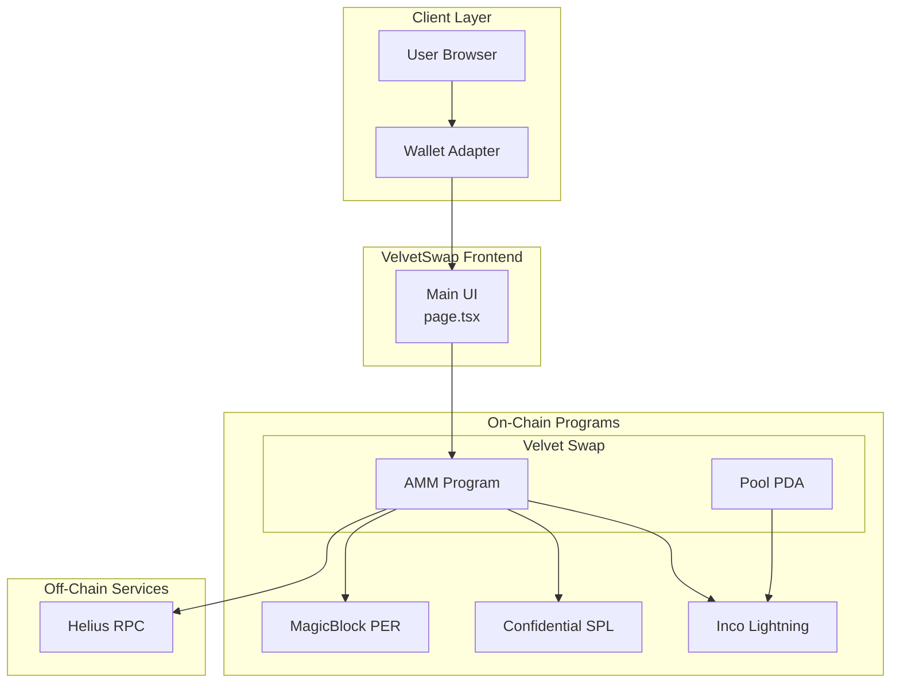
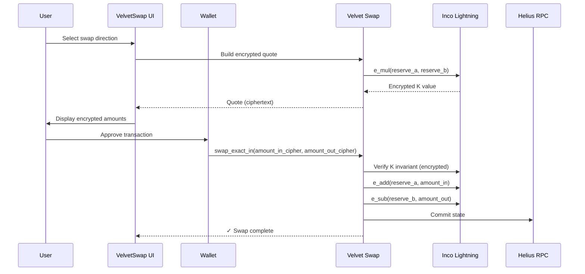
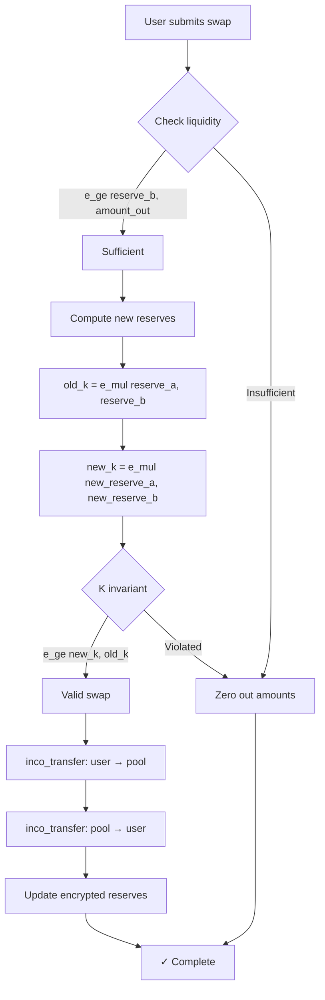
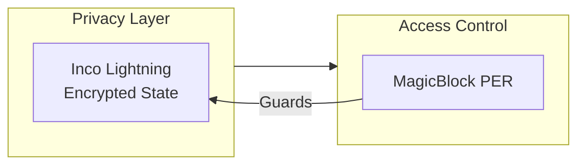

# VelvetSwap Architecture

## Overview

VelvetSwap is a privacy-first confidential swap terminal for Solana, combining:

- **[Velvet Swap](https://github.com/your-username/velvet-swap)** — Confidential AMM with encrypted reserves
- **Inco Lightning** — Encrypted math + Confidential SPL token balances
- **MagicBlock PER** — Permissioned execution for confidential state updates

## System Architecture



## Component Details

| Component | Technology | Purpose |
|-----------|------------|---------|
| **Velvet Swap** | Anchor (Rust) | Confidential AMM with encrypted reserves |
| **Inco Lightning** | Inco Network | Encrypted math via `Euint128` |
| **Confidential SPL** | inco_token | Encrypted token balances |
| **MagicBlock PER** | ephemeral-rollups-sdk | Permissioned execution |

---

## Flow A: Confidential Swap

### Sequence Diagram



### Velvet Swap Instructions

| Instruction | Description |
|-------------|-------------|
| `initialize_pool` | Create pool PDA with `Euint128` reserves |
| `add_liquidity` | Deposit encrypted token amounts |
| `remove_liquidity` | Withdraw encrypted token amounts |
| `swap_exact_in` | Execute swap with encrypted amounts |
| `create_permission` | Register with MagicBlock PER |
| `delegate_pda` | Delegate to MagicBlock validator |

### Swap Logic (Encrypted)



### Privacy Properties

- **Encrypted reserves**: `reserve_a`, `reserve_b` stored as `Euint128`
- **Encrypted transfers**: All token movements use ciphertext
- **Encrypted math**: `e_add`, `e_sub`, `e_mul`, `e_ge` operate on ciphertext
- **Permissioned access**: MagicBlock PER controls state updates
- **No plaintext leakage**: UI displays only hex ciphertext

---

## Security Model



| Layer | Protection |
|-------|------------|
| **State Privacy** | Inco Lightning encrypts all pool reserves and balances |
| **Access Control** | MagicBlock PER gates confidential swaps |

---

## File Structure

```
velvet-rope/
├── src/
│   ├── app/
│   │   └── page.tsx           # Main swap UI
│   ├── lib/
│   │   └── private-swap.ts    # Velvet Swap helpers
└── public/
```

## Related Repositories

| Repository | Description |
|------------|-------------|
| [Velvet Swap](https://github.com/your-username/velvet-swap) | Confidential AMM (Anchor/Rust) |
| [Inco Lightning](https://github.com/Inco-fhevm/inco-solana-programs) | Confidential SPL |

