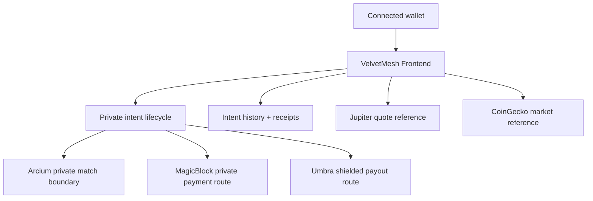
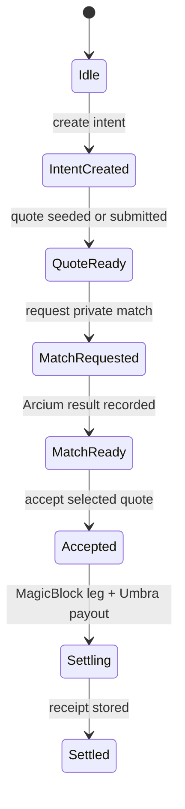

# VelvetMesh Frontend Architecture

> Private intent trading surface for VelvetMesh on Solana devnet.

## Architecture Goal

The frontend is the user-facing product layer for VelvetMesh. It should read as
one coherent private trading experience, not as a sponsor dashboard.

The user flow is:

1. Connect a wallet.
2. Create a private intent.
3. Request or receive private quote state.
4. Accept the verified quote.
5. Settle privately through MagicBlock and Umbra.
6. Review receipts in intent history.

Arcium is the match boundary. MagicBlock is the private payment rail. Umbra is
the shielded payout rail. Jupiter and CoinGecko are market references, not the
core product.

## Client Model

```mermaid
graph TB
    USER["Connected wallet"]
    APP["VelvetMesh Frontend"]
    INTENT["Private intent lifecycle"]
    HISTORY["Intent history + receipts"]
    MATCH["Arcium private match boundary"]
    MAGIC["MagicBlock private payment route"]
    UMBRA["Umbra shielded payout route"]
    JUP["Jupiter quote reference"]
    CG["CoinGecko market reference"]

    USER --> APP
    APP --> INTENT
    APP --> HISTORY
    INTENT --> MATCH
    INTENT --> MAGIC
    INTENT --> UMBRA
    APP --> JUP
    APP --> CG
```

## Important App Surfaces

| Surface | Role |
|---------|------|
| Main swap/intent panel | Create intents and drive the private flow |
| Quote/market card | Show the live price reference and quote context |
| Trade progress panel | Surface match, settlement, and explorer state |
| Intent history panel | Show receipts, match status, and settlement state |

## Route Map

| Route | Role |
|-------|------|
| `/api/velvetmesh/status` | Backend health and route readiness |
| `/api/velvetmesh/intents` | Intent history and private flow state |
| `/api/quotes/jupiter` | Live quote reference |
| `/api/market/coingecko` | Historical chart data |
| `/api/magicblock/private-transfer` | Private USDC settlement payloads |
| `/api/umbra/settlement` | Umbra shielded balance actions |

## Flow Model

```mermaid
stateDiagram-v2
    [*] --> Idle
    Idle --> IntentCreated: create intent
    IntentCreated --> QuoteReady: quote seeded or submitted
    QuoteReady --> MatchRequested: request private match
    MatchRequested --> MatchReady: Arcium result recorded
    MatchReady --> Accepted: accept selected quote
    Accepted --> Settling: MagicBlock leg + Umbra payout
    Settling --> Settled: receipt stored
```

## UI Rules

- Keep the main action as a product action, not an infra action.
- Show sponsor names only where they explain a real dependency.
- Fail closed when devnet signer or route config is missing.
- Persist settlement plans separately from the visible amount input.
- Only show the two-rail settlement path for the supported `USDC -> SOL`
  intent flow.
- Keep the market chart and quote reference visible, but secondary to the
  private intent lifecycle.

## Operational Notes

- The frontend runs on Next.js App Router.
- The app expects devnet RPC and Umbra config in `.env.local`.
- Receipt state is persisted locally for UX continuity and mirrored through the
  app routes.
- The live chart is reference data only; execution still goes through the
  private settlement flow.

## Why This Shape Works

The UI stays legible because it separates three concerns:

- public market reference
- private matching
- private settlement receipts

That is the product story the frontend should always communicate.

